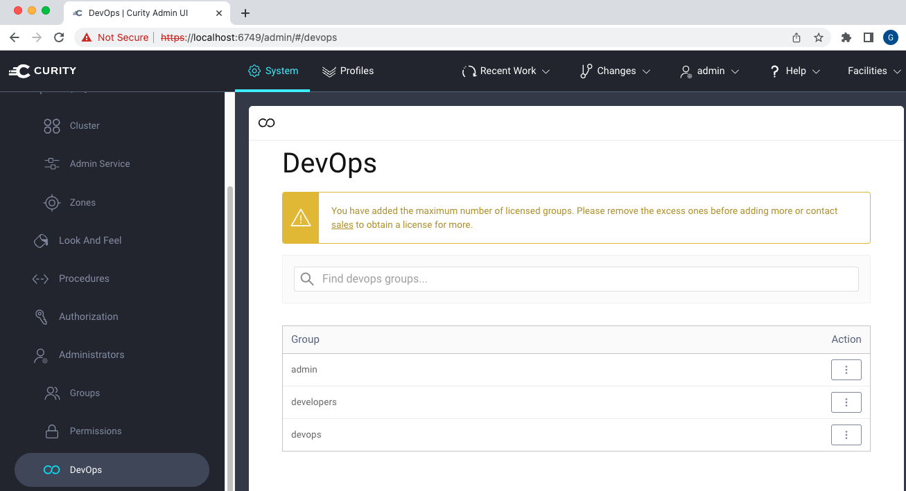
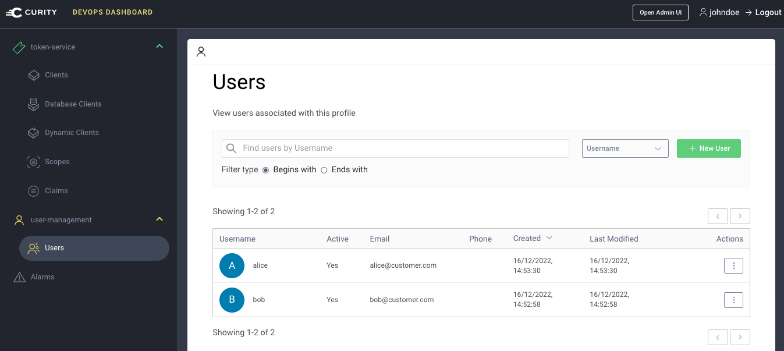
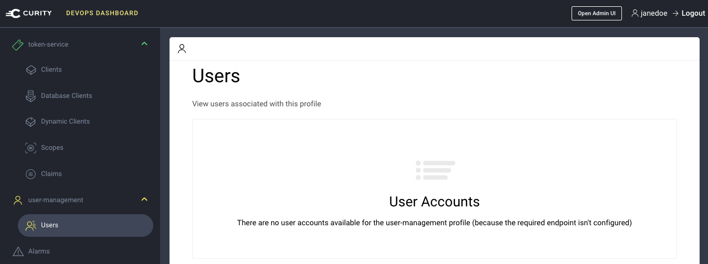

# Devops Dashboard Example

A fast demo setup of the DevOps dashboard for the Curity Identity Server.

## Prerequisites

First ensure that you have a `license.json` file with these features:

- Enterprise license (a trial license is fine)
- Dashboard feature enabled
- Access to 3 or more user groups 

Also ensure that docker and docker compose are installed on the local computer.

## Deploy the System

Clone this repository, then copy the license.json file into the root folder.\
Run the script to deploy the Curity Identity Server and a SQL database containing customer users:

```bash
./deploy.sh
```

## Use the Admin UI

Login at https://localhost:6749/admin with credentials `admin / Password1`.\
The administration permissions for each team is configured under `System / Administrators / DevOps`:



## Use the DevOps Dashboard as a High Privilege User

Login at `https://localhost:6749/admin/dashboard` with the credentials `johndoe`.\
This account represents a high privilege user from a DevOps team who can edit customer users:



## Use the DevOps Dashboard as a Low Privilege User

Login at `https://localhost:6749/admin/dashboard` with the credentials `janedoe`.\
This account represents a low privilege user from a devlopment team, who can only edit OAuth clients:



## Website Documentation

See the [DevOps Dashboard](https://curity.io/resources/learn/devops-dashboard) tutorial for a step by step walkthrough.

## More Information

Please visit [curity.io](https://curity.io/) for more information about the Curity Identity Server.

