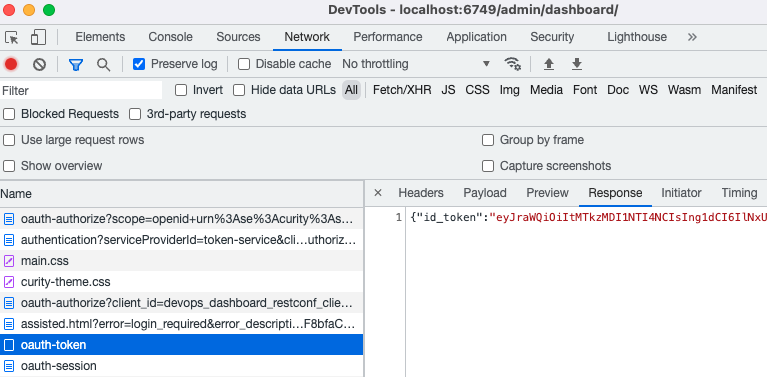

# Debugging Dashboard Access Control

DevOps dashboard logins use the [assisted token flow](https://curity.io/docs/idsvr/latest/developer-guide/oauth-service/web-clients/assisted-token-javascript.html) via a popup window.\
This includes use of framing, so configuration settings must be configured correctly.

## HTTP Schemes

First, ensure that the same HTTP or HTTPS scheme is used by admin and runtime nodes.\
Avoid running the Admin UI on HTTPS and the runtime nodes on HTTP.

## Client Settings

These settings at these Admin UI locations affect the browser permissions needed during dashboard logins.\
In the example setup, these all begin with `https://localhost:6749`:

- System / Zones / Allowed Origins for CORS
- Profiles / Token Service / Clients / devops_dashboard_restconf_client / Allowed Origins
- Profiles / Token Service / Clients / devops_dashboard_restconf_client / Redirect URI
- Profiles / Token Service / Clients / devops_dashboard_restconf_client / Allowed Post Logout Redirect URIs

## Debug Dashboard Logins

If a user is denied access to the DevOps dashboard, it is typically caused by the group claim.\
To debug this, first navigate to the dashboard login screen:

```text
https://localhost:6749/admin/dashboard/#/login
```

Then run browser tools and capture tokens returned to the dashboard UI after login:



If required, view the OpenID Connect authentication request:

```
https://localhost:8443/oauth/v2/oauth-authorize?
scope=openid+urn%3Ase%3Acurity%3Ascopes%3Aadmin%3Aapi
&state=kbUl3F1lokSEH6xF8bfaCxCFfaCTSf4BBkvfNpPSb4slKpADf13UvohwGMvrke4r
&nonce=6P0kOAdJ3CpcaKLbBWlShZEmBIJvQ17TkHMZjh5GMcaDQvk4reD7v2coRV87U5wt
&client_id=devops_dashboard_restconf_client
&response_type=code
&code_challenge=Nh78q8z9VTWlZhU5YXJqQHMk5P9pl_bWg0d-byJF85o
&code_challenge_method=S256
&redirect_uri=https%3A%2F%2Flocalhost%3A6749%2Fadmin%2Fdashboard%2Fassisted.html
&for_origin=https%3A%2F%2Flocalhost%3A6749
```

## Capture Tokens

You can copy tokens returned to browser tools, which will look similar to this:

```json
{
    "id_token":"eyJraWQiOiItMTkzMDI1NTI4NCIsIng1dCI6IlNxUEJFU2gyS3liU1BXUWlNM2VhYnVWSFctQSIsImFsZyI6IlJTMjU2In0.eyJleHAiOjE2NzExMjUwNTAsIm5iZiI6MTY3MTEyMTQ1MCwianRpIjoiM2YwYTJiMzMtMmUyZi00M2QwLWIwNzYtZWM3YTgyMTE4MGJiIiwiaXNzIjoiaHR0cDovL2xvY2FsaG9zdDo4NDQzL29hdXRoL3YyL29hdXRoLWFub255bW91cyIsImF1ZCI6WyJ1cm46c2U6Y3VyaXR5OmF1ZGllbmNlczphZG1pbjphcGkiLCJkZXZvcHNfZGFzaGJvYXJkX3Jlc3Rjb25mX2NsaWVudCJdLCJzdWIiOiJqb2huZG9lIiwiYXV0aF90aW1lIjoxNjcxMTIxNDUwLCJpYXQiOjE2NzExMjE0NTAsInB1cnBvc2UiOiJpZCIsImF0X2hhc2giOiJCWjF4UmV4X0NISjJnei1odV9QdzRRIiwiYWNyIjoidXJuOnNlOmN1cml0eTphdXRoZW50aWNhdGlvbjpodG1sLWZvcm06aHRtbGZvcm0iLCJkZWxlZ2F0aW9uX2lkIjoiNTY2MTgxZmQtZTAzZS00NjMxLWI1MjctODQwODc5ZjRlNTBkIiwic19oYXNoIjoiQ0JkVW40Zk9fLVJxSzBZZHNhb2FuZyIsImF6cCI6ImRldm9wc19kYXNoYm9hcmRfcmVzdGNvbmZfY2xpZW50IiwiYW1yIjoidXJuOnNlOmN1cml0eTphdXRoZW50aWNhdGlvbjpodG1sLWZvcm06aHRtbGZvcm0iLCJub25jZSI6ImJkZmNyOXEyWG96ZExGS1AxbVFnUnpWZU1DNWFQRFZNemhVSjJUbks4MnJVYndRR0RCVVZva2lMVU5hRWY5RWYiLCJzaWQiOiJvdUZrWElhclM3MWFJSTNRIn0.Xo9MP-kk4W_w4Ef5Aw6iCIx789dXQoiWCtLVIZ1k9Vhl4GPbmG6i7g87BqIVWNUaAggy8YhvbgR_HHPfl71rWKE4tTf1bLKS-d7v58uEbFcLM78duZPVWHoD-8gIYXqP-fX6TtAiB0-mdY8vJmdsAezxTnAOD2iSqV9nR2ZW2A1PnovXeLD5TgzICFVowyd2DCMxLUea4HRQO0krCk1l1BYcfW8RJmc3XvKO2_soGrWATNjQ0zdFUp2VXZBm9Tk613E3Pr716D0LIeojA4FcsddWLjqw5rHJZ7worhRDaXNK8VjAjfOZJ-KSOpn3bfQEEysvdFtMslxbRBFNvzUSTw",
    "token_type":"bearer",
    "access_token":"_0XBPWQQ_d18ee5e3-464a-4a86-bb7f-152364daa54e",
    "scope":"openid urn:se:curity:scopes:admin:api",
    "claims":"urn:se:curity:claims:admin:groups",
    "expires_in":299
}
```

## View Access Token Claims

If a user is denied access to the DevOps dashboard, it is typically caused by an invalid group claim.\
Get the access token and introspect it to view claims:

```bash
ACCESS_TOKEN='_0XBPWQQ_d18ee5e3-464a-4a86-bb7f-152364daa54e'
echo $(curl -k -s -X POST https://localhost:8443/oauth/v2/oauth-introspect \
    -u "introspect-client:Password1" \
    -H "Accept: application/json" \
    -H "Content-Type: application/x-www-form-urlencoded" \
    -d "token=$ACCESS_TOKEN") | jq
```

You will then see the groups claim issued.\
For user accounts from a data source, the `groups` claim is used.\
The website tutorial explains how this is populated, and how to test the groups claim for a user:

```json
{
  "sub": "janedoe",
  "purpose": "access_token",
  "iss": "https://localhost:8443/oauth/v2/oauth-anonymous",
  "groups": [
    "developers"
  ],
  "urn:se:curity:claims:admin:groups": [],
  "active": true,
  "token_type": "bearer",
  "client_id": "devops_dashboard_restconf_client",
  "aud": [
    "urn:se:curity:audiences:admin:api",
    "devops_dashboard_restconf_client"
  ],
  "nbf": 1671128075,
  "scope": "openid urn:se:curity:scopes:admin:api",
  
  "exp": 1671128375,
  "delegationId": "c6e216b3-1cd7-4ac0-9a7d-df81c331530a",
  "iat": 1671128075
}
```
